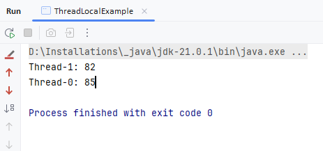

### 🧵 What is `ThreadLocal` in Java?

`ThreadLocal` in Java provides **thread-local variables**, meaning each thread accessing it **gets its own separate copy** of the variable — even though all threads share the same `ThreadLocal` instance.

This is extremely useful when:
- You need to maintain data that **should not be shared** between threads.
- You want to **avoid synchronization** overhead.

---

### ✅ Key Points:

- Each thread has **its own isolated copy**.
- No synchronization is required.
- Common use case: **user sessions**, **database connections**, **log correlation**, etc.

---

### 🔧 How it Works Internally:

Internally, each thread maintains a **map of ThreadLocal variables** (called `ThreadLocalMap`) where:
- The **key** is the `ThreadLocal` object.
- The **value** is the thread’s local value.

```java
Thread → ThreadLocalMap → { ThreadLocal → Value }
```

---

### 🧪 Example: Basic Usage

```java
public class ThreadLocalExample {
    private static ThreadLocal<Integer> threadLocal = ThreadLocal.withInitial(() -> 0);

    public static void main(String[] args) {
        Runnable task = () -> {
            threadLocal.set((int) (Math.random() * 100)); // each thread gets its own value
            System.out.println(Thread.currentThread().getName() + ": " + threadLocal.get());
        };

        Thread t1 = new Thread(task);
        Thread t2 = new Thread(task);

        t1.start();
        t2.start();
    }
}
```

🟢 Output will show **different values per thread**.

---

### 🔄 Common Methods:

| Method                | Description                                      |
|------------------------|--------------------------------------------------|
| `get()`               | Returns the current thread's value               |
| `set(T value)`        | Sets the current thread's value                  |
| `remove()`            | Removes the value for the current thread         |
| `withInitial(Supplier)` | Initializes with a default value             |

---

### 🏦 Real-World Use Case: Database Connection Per Thread

```java
public class DBContext {
    private static ThreadLocal<Connection> connectionHolder = new ThreadLocal<>();

    public static void setConnection(Connection connection) {
        connectionHolder.set(connection);
    }

    public static Connection getConnection() {
        return connectionHolder.get();
    }

    public static void clear() {
        connectionHolder.remove();
    }
}
```

- Each thread has its **own DB connection**, and there's **no risk of cross-thread data corruption**.

---

### ⚠️ Caution:
- Failing to call `remove()` can lead to **memory leaks**, especially in **thread pools** where threads are reused.
- Prefer using `remove()` in a `finally` block.

---

### 🔍 ThreadLocal vs Synchronized

| Feature         | `ThreadLocal`                             | `Synchronized`                                  |
|------------------|---------------------------------------------|--------------------------------------------------|
| Purpose         | Thread-specific variable                  | Shared variable across threads                   |
| Synchronization | Not needed                                | Required to avoid race conditions                |
| Overhead        | Low                                       | Higher due to context switching                  |

---
###  OUTPUT :


---

### 🧠 Interview Tip:
> "`ThreadLocal` is a handy tool when we want to maintain per-thread context like DB connections, user sessions, or request metadata — without worrying about synchronization."

---

